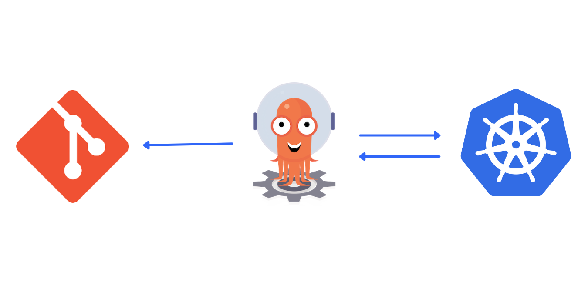

# GitOps with Django & ArgoCD - Part II




This project contains the K8s manifests which will be used to deploy in ArgoCD.


### Prerequisites

Before proceeding, make sure you check the below repository

- [https://github.com/mukulmantosh/django-app](https://github.com/mukulmantosh/django-app)


### Flow

- Make sure Kubernetes is Up and Running
- ArgoCD is already installed
- Run the command -> ```kubectl apply -f argo-app.yml```
- It's going to deploy the manifests pointed in ```dev``` path :)

## References

If you are interested to know more about GitOps & ArgoCD, then you can follow the below links.

- [How to Deploy to Kubernetes using Argo CD and GitOps](https://www.digitalocean.com/community/tutorials/how-to-deploy-to-kubernetes-using-argo-cd-and-gitops)
- [Getting Started with ArgoCD - OpenShift Demos and Workshops](https://demo.openshift.com/en/latest/argocd/) 